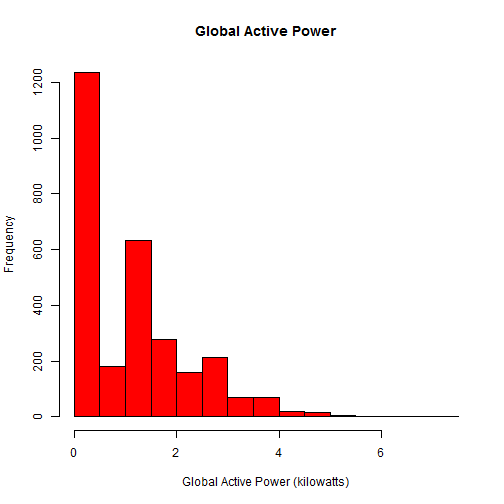
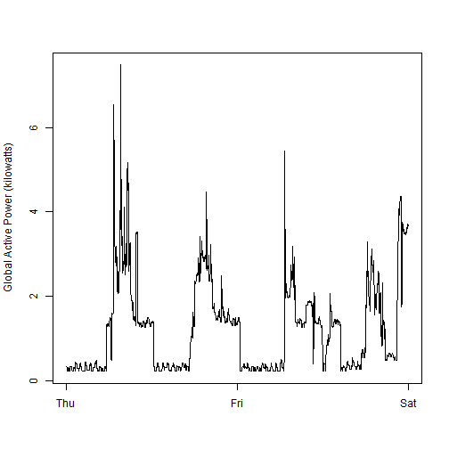
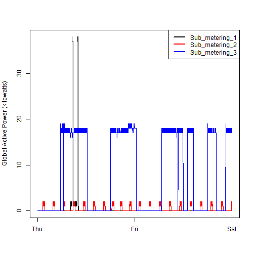
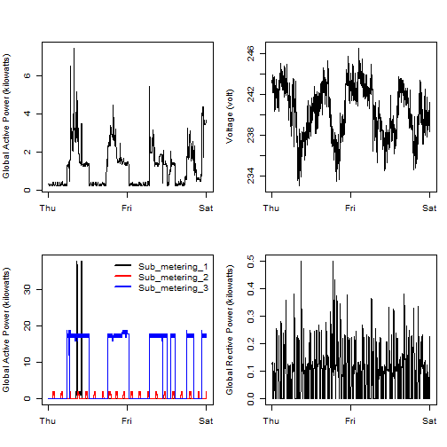

Exploratory Data Analysis:Project 1
======================================
Created by Krish Mahajan 

### Basic settings

```r
echo = TRUE  # Always make code visible
options(scipen = 1)  # Turn off scientific notations for numbers
```

##  q1

```r
data_full <- read.csv("./Data/household_power_consumption.txt", header=T, sep=';', na.strings="?", nrows=2075259, check.names=F, stringsAsFactors=F, comment.char="", quote='\"')
data_full$Date <- as.Date(data_full$Date, format="%d/%m/%Y")

## Subsetting the data
data <- subset(data_full, subset=(Date >= "2007-02-01" & Date <= "2007-02-02"))
rm(data_full)

## merging date and time
datetime <- paste(as.Date(data$Date), data$Time)
data$Datetime <- as.POSIXct(datetime)

## Plot 1
hist(data$Global_active_power, main="Global Active Power", 
     xlab="Global Active Power (kilowatts)", ylab="Frequency", col="Red")
```

 

```r
## Saving to file
dev.copy(png, file="plot1.png", height=480, width=480)
```

```
## png 
##   5
```

```r
dev.off()
```

```
## RStudioGD 
##         2
```

## q2

```r
plot(data$Global_active_power~data$Datetime, type="l",
     ylab="Global Active Power (kilowatts)", xlab="")
```

 

```r
dev.copy(png, file="plot2.png", height=480, width=480)
```

```
## png 
##   5
```

```r
dev.off()
```

```
## RStudioGD 
##         2
```

## q3

```r
with(data, {
    plot(Sub_metering_1~Datetime, type="l",
         ylab="Global Active Power (kilowatts)", xlab="")
    lines(Sub_metering_2~Datetime,col='Red')
    lines(Sub_metering_3~Datetime,col='Blue')
})
legend("topright", col=c("black", "red", "blue"), lty=1, lwd=2, 
       legend=c("Sub_metering_1", "Sub_metering_2", "Sub_metering_3"))
```

 

```r
## Saving to file
dev.copy(png, file="plot3.png", height=480, width=480)
```

```
## png 
##   5
```

```r
dev.off()
```

```
## RStudioGD 
##         2
```

## q4

```r
par(mfrow=c(2,2), mar=c(4,4,2,1), oma=c(0,0,2,0))
with(data, {
    plot(Global_active_power~Datetime, type="l", 
         ylab="Global Active Power (kilowatts)", xlab="")
    plot(Voltage~Datetime, type="l", 
         ylab="Voltage (volt)", xlab="")
    plot(Sub_metering_1~Datetime, type="l", 
         ylab="Global Active Power (kilowatts)", xlab="")
    lines(Sub_metering_2~Datetime,col='Red')
    lines(Sub_metering_3~Datetime,col='Blue')
    legend("topright", col=c("black", "red", "blue"), lty=1, lwd=2, bty="n",
           legend=c("Sub_metering_1", "Sub_metering_2", "Sub_metering_3"))
    plot(Global_reactive_power~Datetime, type="l", 
         ylab="Global Rective Power (kilowatts)",xlab="")
})
```

 

```r
## Saving to file
dev.copy(png, file="plot4.png", height=480, width=480)
```

```
## png 
##   5
```

```r
dev.off()
```

```
## RStudioGD 
##         2
```

